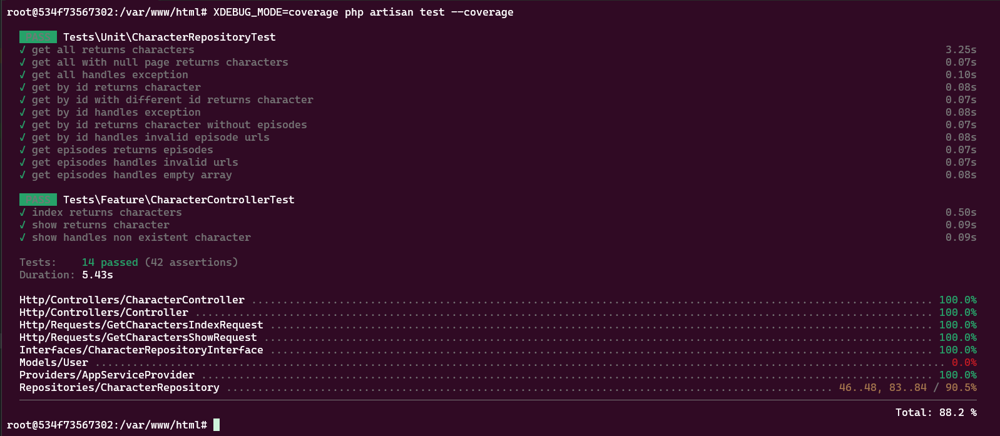

<p align="center"><a href="https://laravel.com" target="_blank"></a></p>

<p align="center">
<a href="https://github.com/laravel/framework/actions"></a>
<a href="https://packagist.org/packages/laravel/framework"></a>
<a href="https://packagist.org/packages/laravel/framework"></a>
<a href="https://packagist.org/packages/laravel/framework"></a>
</p>

## Application Boot

```
cd rick-morty-laravel-vuejs
```
```
cp .env.example .env
```
```
docker-compose up -d
```
```
docker-compose exec app composer install
```
```
docker-compose exec app php artisan key:generate
```
```
docker-compose exec app php artisan migrate
```
```
docker-compose exec app npm install
```
```
docker-compose exec app npm run build
```
## Testing
```
docker-compose exec -it app bash
```
```
XDEBUG_MODE=coverage php artisan test --coverage
```

## UI
 - http://127.0.0.1/characters


